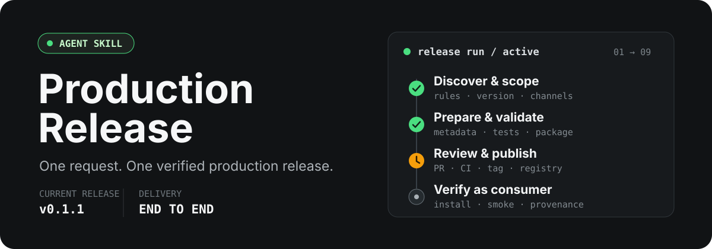

<p align="center">
  
</p>

<p align="center">
  <a href="https://github.com/CaoLiangqiang/Xiaocao-Production-Release/releases/tag/v0.1.1"></a>
  <a href="https://github.com/CaoLiangqiang/Xiaocao-Production-Release/actions/workflows/validate.yml"></a>
  <a href="./LICENSE"></a>
  <a href="https://agentskills.io/specification"></a>
</p>

`production-release` 是一个面向 Codex 的端到端生产发布 Skill。你只需提出一次发布请求，它会先理解目标仓库已有的版本与发布规则，再持续推进准备、审查、发布和消费端验证，而不是留下一份需要手动执行的检查清单。

> 当前正式版本：[`v0.1.1`](https://github.com/CaoLiangqiang/Xiaocao-Production-Release/releases/tag/v0.1.1)

## 发布链路

```text
发布请求
   │
   ├─ 01 发现仓库规则、版本来源与发布边界
   ├─ 02 确定版本、渠道和停止点
   ├─ 03 更新版本、文档与发布说明
   ├─ 04 执行仓库质量门禁和制品检查
   ├─ 05 branch → commit → draft PR → CI → merge
   ├─ 06 tag → registry / hosting release
   ├─ 07 从真实 registry 或全新环境安装
   ├─ 08 验证版本、来源、签名与运行结果
   └─ 09 清理临时产物并报告可追踪链接
```

它不替代 GitHub、npm、PyPI、Cargo 或容器 registry，而是发现并编排目标项目已经在使用的工具、策略和自动化。

| 阶段 | 它负责什么 | 可验证结果 |
| --- | --- | --- |
| 发现 | 读取仓库规则、版本来源、CI、registry 和工作区状态 | 发布范围、版本、渠道与停止点清晰可见 |
| 准备 | 更新元数据和发布说明，执行可信的测试、构建、审计与打包检查 | 待发布 diff 与受检制品保持一致 |
| 交付 | 推进分支、PR、CI、合并、tag 与制品发布 | 远端 commit、tag、Release 和 registry 状态一致 |
| 验证 | 从真实消费端重新安装或拉取并执行代表性检查 | 用户拿到的制品可安装、版本正确且能够运行 |

## 安装

使用 [Skills CLI](https://skills.sh/) 安装当前正式版本：

```bash
npx skills add https://github.com/CaoLiangqiang/Xiaocao-Production-Release/tree/v0.1.1
```

这条命令适用于 Linux、macOS、WSL 和 Windows PowerShell。按照安装向导选择生效范围：

- **个人范围**：对当前用户的所有 Codex 项目生效。
- **项目范围**：安装到当前仓库的 `.agents/skills/production-release`，仅对该项目生效；团队使用时将 `.agents` 和 `skills-lock.json` 一并提交到版本控制。

Codex 通常会自动发现 Skill。若未出现，请重启 Codex 后使用 `/skills` 查看，也可以直接用 `$production-release` 显式调用。

## 使用

完整发布下一个版本：

```text
$production-release 发布这个仓库的下一个生产版本。
```

只准备发布 PR，并停在外部发布之前：

```text
$production-release 准备下一个 patch 版本的 release PR，停在 draft PR。
```

恢复一次结果不明确的发布操作：

```text
$production-release npm publish 刚才超时了。检查外部状态，安全地继续，不要重复上传。
```

明确说“发布、发版、publish、ship”时，Skill 会以完成交付为目标持续执行；只要求检查、准备或创建草稿时，它会停在指定阶段。

## 安全边界

Skill 会尽量减少人工操作，但不会以自动化为理由跨过项目规则或高风险边界。

- **仓库规则优先**：先读取目标仓库的说明、版本来源、CI 和发布自动化，再决定操作方式。
- **范围保持一致**：审查、暂存、打包和发布使用同一组变更，不静默包含无关文件。
- **不绕过门禁**：失败的必需检查、分支保护和强制人工审批不会被跳过或解释为成功。
- **避免重复发布**：远端响应超时或不明确时，先查询外部状态，再决定是否重试。
- **消费端验收**：上传成功不等于发布完成，最终结果必须从真实 registry 或全新环境重新验证。
- **保留人工决策**：登录、2FA、破坏性操作、首次公开、许可选择和不明确的重大版本仍需用户确认。

## 支持的交付面

| 类型 | 典型检查与交付 |
| --- | --- |
| GitHub / GitLab | 分支、draft PR、CI、合并、tag、Release |
| npm / PyPI / Cargo | 打包预检、元数据核对、发布、全新环境安装 |
| 容器 | 构建、测试、不可变版本标签、digest、签名或证明 |
| 其他生态 | 遵循目标仓库已有自动化，并应用同样的不可变版本与消费端验证原则 |

Skill 不要求所有项目安装同一套工具。它只使用仓库证据能够证明适用的命令，并在找不到可信检查时明确标记为未验证。

## 运行要求

- 支持 [Agent Skills](https://agentskills.io/specification) 的 Codex 环境。
- 使用一条命令安装时需要 Node.js `22.20.0` 或更高版本，以及随 Node.js 提供的 `npx`；这不是 Skill 执行时的运行时依赖。
- 本地 Git，以及目标远程仓库所需的认证权限。
- 目标仓库声明的语言运行时、包管理器、构建和测试工具。
- 发布到 GitHub 时建议配置 GitHub connector；仅在能力不足时回退到已登录的 `gh`。
- 发布 registry 制品时，需要目标项目已有的发布身份或可信发布配置。

## 与 `git-ship` 的区别

本项目参考了 [`oil-oil/git-ship`](https://github.com/oil-oil/git-ship) 在触发边界、执行预览、验证命令发现和失败说明方面的设计，但解决的是更长的生产发布链路。

| | `git-ship` | `production-release` |
| --- | --- | --- |
| 主要目标 | 把工作区改动通过分支、PR 和 squash merge 送进 `main` | 完成跨 Git、托管平台和制品仓库的生产发布 |
| 范围 | GitHub Git 交付 | npm、PyPI、Cargo、容器、GitHub Release 等 |
| 策略 | 固定、明确的 Git 工作流 | 优先遵循目标仓库已有发布策略和自动化 |
| 完成标准 | PR 已合并并回到最新 `main` | 制品已发布，并从真实消费者环境验证成功 |

`production-release` 不固定使用 `main`、`origin`、stash、squash merge 或 `git add -A`。它也吸收了 `github:yeet` 的本地 Git 与 GitHub connector 分工、draft PR、防重复和 PR 描述规范，但不会强制依赖 `gh`，也不会在 PR 创建后停止。

<details>
<summary><strong>项目结构与维护说明</strong></summary>

```text
production-release/
├── .github/workflows/validate.yml # Agent Skill 结构 CI 校验
├── agents/openai.yaml             # Codex 界面信息和默认提示
├── assets/readme/hero.svg         # README 视觉标题与发布链路概览
├── .gitignore                     # 本地过程文件忽略规则
├── LICENSE                        # MIT 许可证
├── README.md                      # 用户与维护说明
└── SKILL.md                       # Agent 执行规范
```

本项目本身不包含守护进程、运行时服务、生产依赖或需要编译的可执行文件。`SKILL.md` 是唯一执行入口，`agents/openai.yaml` 提供 Codex 界面名称、简述和默认调用提示；不可变 Git tag 和 GitHub Release 标识正式版本，Skills CLI 负责将选定版本安装到规范目录。

每次 PR 和向 `main` 的推送都会执行 `Validate skill` 工作流，检查 `SKILL.md` 的名称、描述与正文，以及 `agents/openai.yaml` 的关键字段。修改发布行为时，请同时说明成功路径、失败路径和恢复方式，不要为单一仓库硬编码分支名、合并策略、包管理器或托管平台。

</details>

## License

[MIT](./LICENSE)
